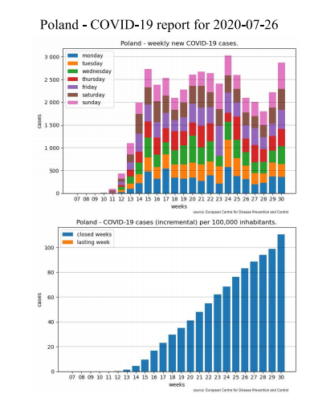

# General info
Application that downloads data concerning COVID-19 cases from „European Centre for Disease Prevention and Control” and generates reports for Poland, Europe and world. Data is presented per week.

# Requirements
1. Python >= 3.5
2. libraries:
   - requests
   - datetime
   - locale
   - matplotlib
   - os
   - traceback
    
# Report example

